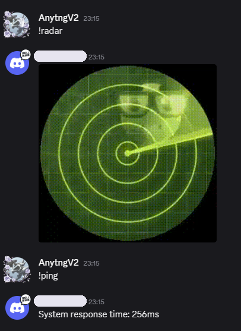

# Discord Selfbot Base

<div align="center">
  <picture>
    <source media="(prefers-color-scheme: dark)" srcset="./previews/logo_dark_theme.png">
    
  </picture>
</div>

<p align="center">
  <strong>A lightweight, pre-built Discord selfbot foundation for rapid and simple selfbot development.</strong>
</p>

<div align="center">


</div>


---

## 📖 About

This project provides a clean, ready-to-use foundation for creating Discord selfbots without boilerplate setup. It handles the core infrastructure—command loading, environment configuration, and message handling—so you can focus on writing actual functionality.

**How it works:** The bot automatically imports all JavaScript files from the `commands/` directory, listens for messages starting with the `!` prefix, and executes commands only when triggered by the authorized owner (specified in your `.env` file). This ensures secure, personalized automation.

## ✨ Features

- 🚀 **Instant Setup:**  Pre-built core with command auto-loading -start coding features immediately.
- 🔒 **Secure by Default:** Owner-only command execution prevents unauthorized access.
- 🛠️ **Extensible:** Drop new command files into `commands/` no core changes needed.
- 🎨 **Lightweight:** Minimal dependencies, fast startup, efficient resource usage.

## 📦 Installation

Follow these steps to get SelfBot up and running:

1. **Clone or Download the Repository:**
   ```
   git clone https://github.com/anytngv2/discord-selfbot-base
   cd selfbot
   ```

2. **Install Dependencies:**
   ```
   npm install
   ```

3. **Configure Environment Variables:**
   - Copy `.env.sample` to `.env`:
     ```
     cp .env.sample .env
     ```
   - Edit `.env` and add your details:
     - `TOKEN`: Your Discord user account token (obtain carefully).
     - `OWNER_ID`: Your Discord user ID (the bot will only respond to you).

5. **Start the SelfBot:**
   ```
   node index.js
   ```
   or
   ```
   npm run start
   ```

## 🚀 Usage

Once running, the selfbot logs in and monitors all messages. When you (the owner) send a message starting with `!` , it executes the matching command from the `commands/` folder.

***example workflow:***
- Create ```commands/ping.js```, and send `!ping` in any channel. -> Bot executes your code.

## 📸 Preview

<div align="center">
  
</div>

## 🤝 Contributing

Contributions to improve the base infrastructure are welcome. Submit issues or pull requests for bug fixes or core enhancements.

## 📄 License

This project is licensed under the ISC License. See the LICENSE file for details.